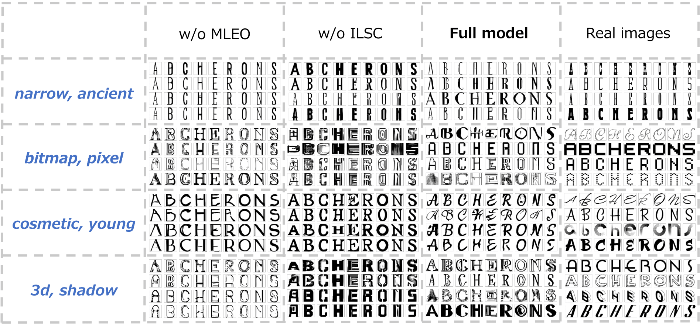

# Font Generation with Missing Impression Labels(ICPR2022)
This repository provides PyTorch implementation for [**Font Generation with Missing Impression Labels**](https://arxiv.org/abs/2203.10348). Given an *impression labels*, our proposed model can generate the appropriate style font image. This paper proposes a font generation model that is robust against missing impression labels. 


**Note:**
In our other studies, we have also proposed font generation model from specific impression. Please check them from the links below.
- [**Impressions2Font: Generating Fonts by Specifying Impressions**](https://arxiv.org/abs/2103.10036) (ICDAR 2021): GAN for font generation with specific impression.
## Paper
**Font Generation with Missing Impression Labels**.<br>
Seiya Matsuda, Akisato Kimura, and Seichi Uchida<br>
Accepted ICPR2022

[**[Paper]**](https://arxiv.org/abs/2203.10348)

## Abstract
Our goal is to generate fonts with specific impressions, by training a generative adversarial network with a font dataset with impression labels. The main difficulty is that font impression is ambiguous and the absence of an impression label does not always mean that the font does not have the impression. This paper proposes a font generation model that is robust against missing impression labels. The key ideas of the proposed method are (1)a co-occurrence-based missing label estimator and (2)an impression label space compressor. The first is to interpolate missing impression labels based on the co-occurrence of labels in the dataset and use them for training the model as completed label conditions. The second is an encoder-decoder module to compress the high-dimensional impression space into low-dimensional. We proved that the proposed model generates high-quality font images using multi-label data with missing labels through qualitative and quantitative evaluations.

## Installation

Clone this repo:

```bash
git clone https://github.com/SeiyaMatsuda/Font-Generation-with-Missing-Impression-Labels.git
cd Font-Generation-with-Missing-Impression-Labels/
```
First, install Python 3+. Then install [PyTorch](https://pytorch.org/) 1.0 and other dependencies by

```bash
pip install -r requirements.txt
```
## Datasets
Download the dataset from [Google Drive](https://drive.google.com/u/0/open?id=10GRqLu6-1JPXI8rcq23S4-4AhB6On-L6). Place in the following directory. 

```bash
./Myfont/dataset/
```

This dataset is constructed by Chen et al. [*large-scale Tag-based Font Retrieval with Generative Feature Learning*](https://arxiv.org/abs/1909.02072). ICCV 2019


## train

### Example
To train our proposed model on **MyFonts Dataset**, run the following:

```bash
python main.py
```

## Test
To generate images, use the following script:

```bash
python test.py \
    --label impression words \
    --g_path trained_model_path \
    --out output_directory_path
```

Please choose one of the options in the square brackets ([ ]).

### Example
To generate a font from the impression word **elegant**, run the following:

```bash
python test.py \
    --label elegant
    --g_path outputs/img_iter_100000.pth \
    --out samples
```

## MyFonts Dataset
We use the MyFonts dataset in all our experiments. From the dataset, we removed dingbats (i.e., unreadable illustrations) by manual inspections. We removed impression labels that are not in the vocabularies of word2vec, which was pre-trained by the Google News Dataset. As a result, we use $N=17,202$ fonts (among 18,815) and $K=1,430$ impression labels (among 1,824) in the experiment. The maximum, minimum, and average numbers of impression labels for each font are 184, 1, and 14.39, respectively. 


## Examples of generated images
### Impression words you can input
**single impression word.**
The original **ten** classes (0,...,9; defined in (a)) are divided into **five** classes (*A*,...,*E*) with class overlapping, as shown in (b).


**multiple impression word.**
Each column shows samples associated with the same class-distinct and class-mutual states: *airplane*, *automobile*, *bird*, *cat*, *deer*, *dog*, *frog*, *horse*, *ship*, and *truck*, respectively, from left to right. Each row includes samples generated from a fixed ***z****<sup>g</sup>* and a varied ***y****<sup>g</sup>*. CP-GAN (b) succeeds in selectively generating class-distinct (red font) and class-mutual (blue font) images, whereas AC-GAN (a) fails to do so.



## Citation
If you use this code for your research, please cite our paper.

```
@inproceedings{matsuda2021fontgeneration,
  title={Font Generation with Missing Impression Labels},
  author={Matsuda, Seiya and Kimura, Akisato and Uchida, Seiichi},
  booktitle={ICPR},
  year={2022}
}

